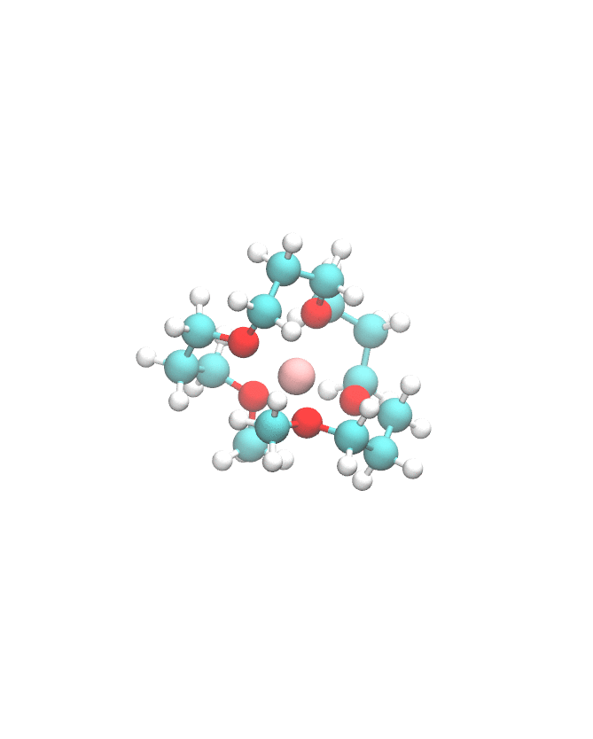
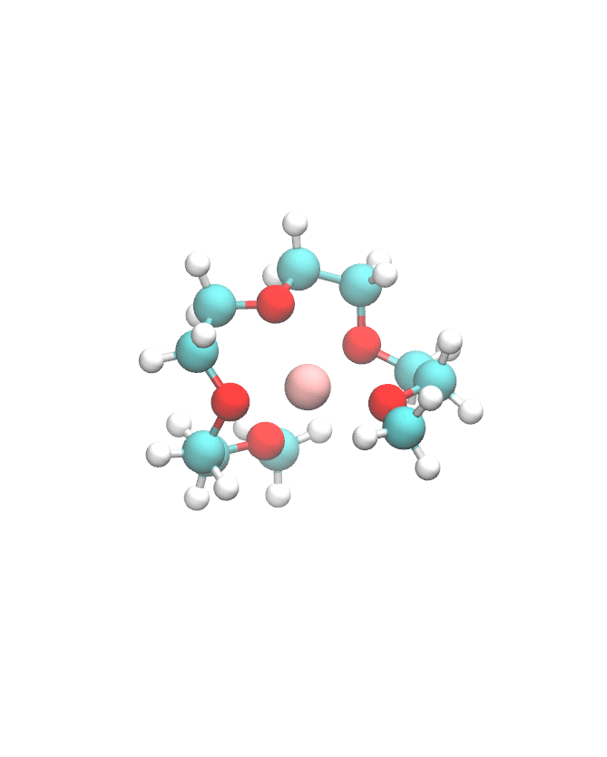

# MLElectrolytes
Electrolyte DFT data from computational screening.

## Project: Screen Ether Molecules for Solvate Ionic Liquid Applications 

Example optimized cluster geometry 
<p align="center">
  
   
</p>


Our publication:

```
@article{Wang2020,
author = {Wang, Wujie and Yang, Tzuhsiung and Harris, William Hunt and Gomez-Bombarelli, Rafael and G{\'{o}}mez-Bombarelli, Rafael},
file = {::},
issn = {1359-7345},
journal = {Chemical Communications},
mendeley-groups = {wwj/paper-superglyme},
month = {aug},
number = {63},
pages = {8920},
title = {{Active learning and neural network potentials accelerate molecular screening of ether-based solvate ionic liquids}},
url = {https://pubs.rsc.org/en/content/articlehtml/2020/cc/d0cc03512b https://pubs.rsc.org/en/content/articlelanding/2020/cc/d0cc03512b http://pubs.rsc.org/en/Content/ArticleLanding/2020/CC/D0CC03512B},
volume = {56},
year = {2020}
}

```

dataset description:

data/cluster.csv: DFT data for ether-ion interactions calculated at wB97X-D3/def2-TZVP and BP86-D3/def2-SVP level of theory 

| Column Name      | Description        |
| -----------      | -----------        |
|smiles            |        SMILES string |
|abbr              |molecule abbreviation based on the size of carbon spacers |
|O_count           |number of oxygens|
|C:O               |ratio between carbon atoms and oxygen atoms |
|wbx_li_ebind      |Ether Lithium ion Binding Energy(wB97X-D3/def2-TZVP) E_bind = E_complex - E_ion - E_molecule|
|bp86_li_ebind     |Ether Lithium ion Binding Energy(BP86-D3/def2-SVP) E_bind = E_complex - E_ion - E_molecule|
|wbx_na_ebind      |Ether Sodium ion Binding Energy(wB97X-D3/def2-TZVP) E_bind = E_complex - E_ion - E_molecule|
|bp86_na_ebind     |Ether Sodium ion Binding Energy(BP86-D3/def2-SVP) E_bind = E_complex - E_ion - E_molecule|
|wbx_mg_ebind      |Ether Magnesium ion Binding Energy(wB97X-D3/def2-TZVP) E_bind = E_complex - E_ion - E_molecule|
|bp86_mg_ebind     |Ether Magnesium ion Binding Energy(BP86-D3/def2-SVP) E_bind = E_complex - E_ion - E_molecule|
|wbx_mol_homo      |Ether HOMO(wB97X-D3/def2-TZVP) |
|bp86_mol_homo     |Ether HOMO(BP86-D3/def2-SVP) |
|wbx_li_homo       |Ether Lithium ion HOMO (wB97X-D3/def2-TZVP) |
|bp86_li_homo      |Ether Lithium ion HOMO (BP86-D3/def2-SVP) |
|wbx_na_homo       |Ether Sodium ion HOMO (wB97X-D3/def2-TZVP) |
|bp86_na_homo      |Ether Sodium ion HOMO (BP86-D3/def2-SVP) |
|wbx_mg_homo       |Ether Magnesium ion HOMO (wB97X-D3/def2-TZVP)|
|bp86_mg_homo      |Ether Magnesium ion HOMO (BP86-D3/def2-SVP)|

/geoms/ether_ion.pkl: Optimized geometry with binding energy (wB97X-D3/def2-TZVP)
